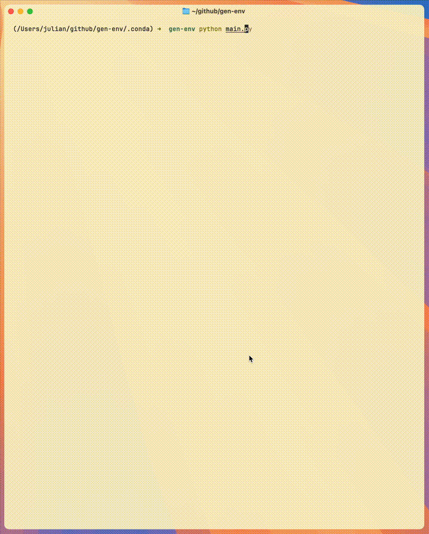

# Simple Coder



An extensible baseline for building, testing, and training sandboxed AI coding agents.

The world of AI coding agents is filled with complex frameworks that hide core mechanics and naive environments that lack proper security. We wanted a transparent, unopinionated, and secure-by-default starting point. This is it.

`Simple Coder` provides a minimal, high-fidelity sandbox so you can focus on building your agent, not the boilerplate around it.

## Core Design

1.  **Sandboxed by Default**: All command execution happens inside a Docker container, volume-mounted to a local directory. The agent can explore and make changes without compromising the host system.
2.  **Transparent Agent Loop**: The `(Agent -> Tool -> Environment)` loop is the fundamental unit of work. It is exposed directly in `gen_env/env.py`, making it easy to inspect, debug, and extend.
3.  **Real-World Artifacts**: When the agent completes its task, it generates a standard `git diff`. This isn't a proprietary format; it's a universal patch that reflects the agent's work against the initial state of the project.

## How It Works

The entire process is orchestrated by the `GenEnv` class, which manages a single "episode" of the agent's work.

1.  **Initialization**: When `GenEnv.run_episode(directory, prompt)` is called, it:

    - Copies the target project into a temporary workspace.
    - Initializes a `git` repository and creates an initial commit to serve as a clean baseline.
    - Starts a lightweight Docker container with the project directory volume-mounted to `/workspace`.

2.  **The Agent-Tool Loop**:

    - The `GenEnvAgent` is given the user's prompt and a definition of its available tools (`shell`, `finish`).
    - The agent decides which tool to use. `GenEnv` intercepts the call and executes it in the appropriate context (e.g., `docker exec` for shell commands).
    - The tool's output (`stdout` and `stderr`) is sent back to the agent, and the loop continues.

3.  **Completion**:
    - The episode ends when the agent calls the `finish` tool or reaches the `max_steps` limit.
    - `GenEnv` generates a final `git diff` against the initial commit, producing a clean patch file.

## Getting Started

### Prerequisites

- Python 3.9+
- Docker Desktop (must be running)
- An OpenAI API key

### Setup & Run

1.  **Clone the repository:**

    ```bash
    git clone git@github.com:julianallchin/simple-coder.git
    cd simple-coder
    ```

2.  **Create an environment file:**
    Create a file named `.env` in the project root and add your API key:

    ```
    OPENAI_API_KEY="sk-..."
    ```

3.  **Install dependencies:**

    ```bash
    pip install -r requirements.txt
    ```

4.  **Run the demo:**
    ```bash
    python main.py
    ```
    This will start an agent tasked with fixing a bug in the `examples/fix_tests` directory. The agent will build a Docker image, run tests, apply changes, and verify the fix.
